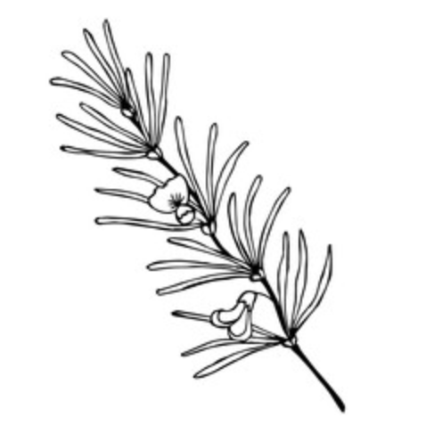

<div align="center">
  <a href="https://github.com/Bubblyworld/rooibos-dao">
    
  </a>

  <h3 align="center">RooibosDAO</h3>

  <p align="center">
    Contracts and front-end code for the RooibosDAO project.
  </p>
</div>

<ol>
  <li><a href="#about-the-project">About The Project</a></li>
  <li>
    <a href="#getting-started">Getting Started</a>
    <ul>
      <li><a href="#prerequisites">Prerequisites</a></li>
      <li><a href="#installation">Installation</a></li>
      <li><a href="#running-locally">Running Locally</a></li>
      <li><a href="#running-tests-locally">Running Tests Locally</a></li>
    </ul>
  </li>
  <li><a href="#roadmap">Roadmap</a></li>
  <li><a href="#contact">Contact</a></li>
</ol>


## About The Project

Contract and front-end code for the RooibosDAO project. More to say about this soon.


## Getting Started

RooibosDAO currently has two moving parts. The first is the solidity contracts, which are managed with [truffle](https://trufflesuite.com) and stored in `contracts/`. The second is the front-end web app for interacting with the contracts, which is a standard [react](https://reactjs.org) project and is stored in `app/`. To run the app locally, you will need to set up a local development blockchain, deploy the contracts to this blockchain and then serve the web app. This process is detailed below.

### Prerequisites

Dependencies for both the solidity contracts and the web app are managed using [npm](https://www.npmjs.com), and the `truffle` tool suite is run with [node](https://nodejs.org/en/). Unfortunately, `truffle` has some compatibility issues with `node v14.x.x` and `npm v8.x.x`, and thus we recommend installing `node v13.x.x` and `npm v6.x.x` for working in this codebase. A nice tool for managing different `node` and `npm` installations is [fnm](https://github.com/Schniz/fnm).

### Installation

Next, you will need to clone the project and install its dependencies:

1. Clone the repo:
   ```sh
   $ git clone git@github.com:Bubblyworld/rooibos-dao.git
   $ cd rooibos-dao
   ```
2. Install contract dependencies and the `truffle` tool suite:
   ```sh
   $ npm install
   ```
3. Install front-end dependencies:
   ```sh
   $ cd app
   $ npm install
   ```
   
### Running Locally

To set up a local development blockchain, run `npx truffle dev`:

```sh
$ npx truffle dev

Truffle Develop started at http://127.0.0.1:8545/

Accounts:
(0) 0xc72ff55a4bb5ed0022f6ed76a25f3ff04c8c5942
(1) 0x1be1d4b61fcd6db93a1956349767cd18b64733e3
(2) 0x821cd17c2c06de3365856deb4aa5fa8c049a76c1
[...]

truffle(develop)>
```

Truffle will list a bunch of useful information, such as the accounts it has automatically set up for you with a large sum of ethereum, and then drop you into a command shell (which is actually a javascript REPL!). To compile and deploy the contracts to this blockchain, type `migrate`:

```sh
truffle(develop)> migrate

Compiling your contracts...
[...]

Summary
=======
> Total deployments:   2
> Final cost:          0.003988403716332116 ETH

truffle(develop)>
```

Next, open another terminal session and head to the `app` directory. Here you can serve the web app in development mode using `npm run start`:

```sh
$ npm run start

Compiled successfully!

You can now view app in the browser.

  Local:            http://localhost:3000
  On Your Network:  http://10.0.0.12:3000
```

Opening the link will take you to a local version of the app that automatically connects to your local blockchain.

### Running Tests Locally

To run the contract tests in the `test/` directory, use `npx truffle test`. This will compile the contracts and run the test scripts against a local development blockchain.

```sh
$ npx truffle test

Using network 'test'.

TestRooibosDao
    ✓ testNonZeroAdmin (1093ms)

  Contract: RooibosDao
    ✓ ...should have non-zero admin address. (66ms)
```


## Roadmap

- [ ] Come up with a roadmap.


## Contact

Maciej Fijalkowski - fijall@gmail.com
<br/>
Guy Paterson-Jones - guy.paterson.jones@gmail.com
